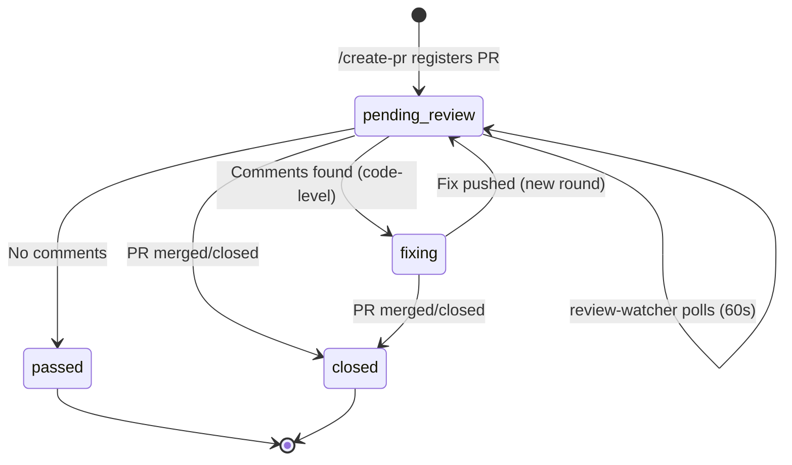

# Architecture Decisions

Key architectural decisions made during the design and implementation
of the Git Collaboration Workflow Plugin.

---

## ADR-001: Prompt-Based Hooks over Command Hooks

**Decision**: All 8 hooks use prompt-based evaluation instead of bash
command scripts.

**Context**: Claude Code supports two hook types:
- **Prompt-based**: LLM evaluates the tool call against natural language rules
- **Command-based**: Bash script performs deterministic validation

**Rationale**:
- The plugin's design constraint is "all logic in markdown prompts" — no
  compiled code or external scripts
- Prompt-based hooks provide context-aware evaluation (Claude sees the
  full conversation context, not just the command)
- Edge cases are handled more naturally through reasoning rather than regex
- Maintenance is simpler — modify a prompt string vs. debug a bash script

**Tradeoff**: Prompt-based hooks for file-content scanning (detect-secrets,
detect-conflict-markers) rely on Claude's conversation context rather than
directly inspecting file contents. This means detection accuracy depends on
whether Claude has recently viewed the files being committed. For defense-
in-depth, CI-side checks (commitlint, secret scanning) provide the server-
side backup.

---

## ADR-002: Consolidated hooks.json vs. Individual Hook Files

**Decision**: All hooks are defined in a single `hooks/hooks.json` file
rather than individual `.md` files per hook.

**Context**: The original spec planned 8 individual `.md` hook files.
During implementation, the Claude Code plugin API was found to require
hooks in `hooks/hooks.json` format.

**Rationale**:
- Follows the official Claude Code plugin hooks API
- Single file for all hook definitions simplifies plugin loading
- Each hook is still independently identifiable by its prompt name
- Reduces file count from 18 to 12 without losing functionality

---

## ADR-003: Tiered Blocking Strategy

**Decision**: Use a three-tier blocking system: hard-block (deny),
soft-block (ask), and warn-only (allow with message).

**Context**: Different branches have different protection levels.

**Implementation**:

| Branch | Push | Force Push | Rebase |
|--------|------|------------|--------|
| `main` | Hard-block | Hard-block | Hard-block |
| `integration` | Soft-block | Soft-block | Hard-block |
| `feature/*` | Allow | Warn | Allow |

**Rationale**:
- `main` is production — no exceptions, no bypasses
- `integration` is staging — usually protected but experienced users
  may have legitimate reasons to override
- Feature branches are personal — warnings inform but don't block

---

## ADR-004: Plugin-Only vs. GitHub-Enforced Rules

**Decision**: The plugin handles developer-side validation only. GitHub
branch protections handle server-side enforcement.

**Boundary**:

| Rule | Plugin (developer-side) | GitHub (server-side) |
|------|------------------------|---------------------|
| Commit message format | ✅ enforce-commit-format hook | Optional commitlint CI |
| Branch naming | ✅ enforce-branch-naming hook | — |
| Push to main | ✅ prevent-direct-push hook | ✅ Branch protection |
| Force push | ✅ prevent-force-push hook | ✅ Branch protection |
| Squash merge | — (not plugin's job) | ✅ Merge method restriction |
| Required reviews | — (not plugin's job) | ✅ Branch protection |
| Status checks | — (not plugin's job) | ✅ Branch protection |
| Merge queue | ✅ conflict detection | ✅ Queue management |

**Rationale**:
- Defense-in-depth: critical rules have both layers
- Plugin catches issues before they reach the remote (faster feedback)
- GitHub catches anything the plugin misses (ultimate safety net)
- No duplication of server-side enforcement in the plugin

---

## ADR-005: SemVer Label Strategy

**Decision**: SemVer version bumps are determined by PR labels, not by
analyzing commit messages at merge time.

**Rationale**:
- Labels are visible and editable in the GitHub UI
- Humans can override automated label suggestions
- Merge queue and release workflows can query labels efficiently
- Consistent with the architecture report's tagging strategy

**Label mapping**:
- `semver:patch` — Bug fixes, docs, chores → v1.2.X
- `semver:minor` — New features → v1.X.0
- `semver:major` — Breaking changes → vX.0.0

---

## ADR-006: Conflict Detection Scope

**Decision**: The `/create-pr` skill checks for file-level overlaps
against both open PRs and PRs in the merge queue.

**Rationale**:
- Open PR conflicts: warning (the other PR might be updated or closed)
- Merge queue conflicts: higher-priority warning (the queued PR is about
  to merge, so conflict is imminent)
- File-level granularity is sufficient — line-level diff analysis would
  be too slow and too noisy
- This reduces merge queue ejections by catching conflicts before submission

---

## ADR-007: Hybrid Hook Strategy (Command + Prompt)

**Decision**: Four hooks use both a command script and a prompt hook in
parallel. The remaining three hooks use prompt-only.

**Context**: The original design (ADR-001) used prompt-only hooks. While
this simplified maintenance, it introduced two critical gaps:
1. Prompt hooks for deterministic checks (regex) are slow (10-30s vs <1s)
2. Prompt hooks cannot read file contents directly — they depend on
   conversation context, which means secrets and conflict markers go
   undetected if Claude hasn't recently viewed the files

**Implementation**:

| Hook | Command Script | Prompt | Rationale |
|------|---------------|--------|-----------|
| enforce-commit-format | `validate-commit-msg.sh` | Yes | Regex is deterministic; prompt handles HEREDOC edge cases |
| enforce-branch-naming | `validate-branch-name.sh` | Yes | Regex is deterministic; prompt handles unusual syntax |
| detect-secrets | `scan-secrets.sh` | Yes | Script reads actual files; prompt catches patterns from context |
| detect-conflict-markers | `scan-conflict-markers.sh` | Yes | Script scans staged files; prompt uses conversation memory |
| prevent-direct-push | — | Yes | Push target parsing requires contextual reasoning |
| prevent-force-push | — | Yes | Force flag + branch context requires reasoning |
| prevent-rebase-shared | — | Yes | Current branch determination requires conversation context |

**Execution model**: Command and prompt hooks within the same matcher run
in parallel. If either denies, the operation is blocked. This provides
defense-in-depth: the command hook gives instant feedback while the prompt
hook catches edge cases the script misses.

**Tradeoff**: Slightly higher total latency for hybrid hooks (both must
complete), but the command hook provides immediate user feedback while the
prompt hook continues evaluating in the background.

---

## ADR-008: Code Review as Plugin Skill (Not Agent)

**Decision**: Code review is implemented as a `/review-pr` skill, not as
an autonomous agent.

**Rationale**:
- Code review is inherently interactive — users need to discuss findings,
  ask "why?", and evaluate tradeoffs
- Skills have access to the full tool chain (Glob, Grep, Read, Edit) for
  deep code analysis. Agents are limited to declared tools
- Claude Code agents cannot poll or auto-trigger on external events (no
  webhook support). An agent would still require manual invocation, making
  it functionally equivalent to a skill but with less interactivity
- The existing `merge-bot` agent handles mechanical merge decisions well;
  review requires judgment that benefits from user dialogue

---

## ADR-009: Teammates-Based Cloud Review Engine

**Decision**: Cloud code review monitoring and auto-fix use the Claude Code
Teammates architecture (TeamCreate + Agent + SendMessage) rather than
standalone polling scripts.

**Context**: Cloud code review on GitHub Actions takes 5-15 minutes. During
this time, developers should be able to continue working. The previous
approach of standalone bash scripts (`poll-review.sh` + `launch-fix.sh`)
had several limitations:
- No communication channel back to the developer
- No ability to categorize issues (code-level vs logic-level)
- No cross-session recovery if Claude Code session ends during polling

**Architecture**:

**Components**:

| Component | Type | Purpose |
|-----------|------|---------|
| `review-watcher` | Agent (Teammate) | Polls GitHub Actions, categorizes comments, auto-fixes code issues |
| `review-tracker.sh` | Bash script | Local JSON DB at `.claude/review-tracker.json` for state persistence |
| `/check-review` | Skill | Manual status query, offers to spawn review-watcher |
| `/create-pr` (enhanced) | Skill | Registers PR in tracker, offers review-watcher spawn |
| `post-merge-cleanup.sh` | PostToolUse hook | Detects merge completion, suggests branch cleanup |
| SessionStart (enhanced) | Hook | Checks tracker DB for pending reviews on session start |

**Communication Flow**:

1. `/create-pr` creates PR → registers in `review-tracker.json` → offers
   to spawn `review-watcher` teammate
2. `review-watcher` polls GitHub Actions every 60s via `gh pr checks`
3. On review completion:
   - **Code-level issues** (syntax, formatting, variables): auto-fix →
     commit → push → poll next round
   - **Logic-level issues** (architecture, design): `SendMessage` to main
     controller with full details → wait for human decision
4. On PR merge/close: update tracker DB → notify controller → shut down

**Cross-Session Recovery**:

The `review-tracker.json` local DB persists across Claude Code sessions.
On SessionStart, `check-repo-status.sh` checks for active reviews and
recommends `/check-review` if pending reviews exist. This handles the case
where a review-watcher was running but the session ended before completion.

**Rationale**:
- Teammates provide bidirectional communication (SendMessage) — logic
  issues can be escalated to the developer without blocking
- Agent framework handles process lifecycle management
- Local JSON DB provides cheap, git-ignored persistence without external
  dependencies
- Separation of code-level (auto-fix) and logic-level (human decision)
  reflects the reality that not all review comments can be mechanically
  resolved

