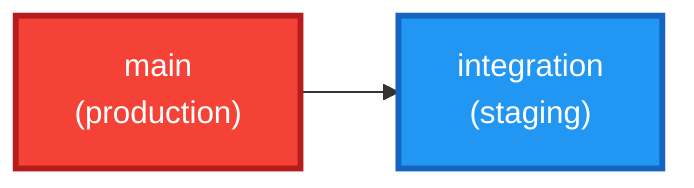

# /repo-graph — Repository Visualization

**Version Compatibility**: Before executing, verify that all referenced tools
and APIs are available. If any tool or API referenced in this workflow is
unavailable, skip that specific step with a notice to the user rather than
failing entirely.

## Purpose

Generate visual diagrams of the repository's branch structure, commit history,
and branch states using Mermaid syntax. Uses a backing script to collect
structured data, then renders Mermaid diagrams from the data.

## Pre-flight

1. Verify this is a git repository: `git rev-parse --git-dir`
   - If not: report and stop.

## Steps

### Step 1 — Select Diagram Type

Ask the user which diagram(s) to generate:

| Option | Diagram | Best For |
|--------|---------|----------|
| 1 | Branch Topology (flowchart) | Understanding overall branch structure and relationships |
| 2 | Commit Timeline (gitGraph) | Seeing recent commit history across branches |
| 3 | Branch State (stateDiagram) | Checking current status of each branch |
| all | All three | Full repository overview |

### Step 2 — Collect Repository Data

Execute the backing script to gather structured data:

```bash
# For specific diagram type
bash "${CLAUDE_PLUGIN_ROOT}/scripts/repo-graph-data.sh" "<topology|timeline|state|all>"
```

Parse the JSON output:

| Field | Description |
|-------|-------------|
| `status` | `ok` or `error` |
| `diagram_type` | Requested diagram type |
| `current_branch` | Current checked-out branch |
| `total_branches` | Total branch count |
| `branch_counts` | Object with counts by type (feature, hotfix, release, phase) |
| `branches` | Array of branch objects with name, type, head, dates, ahead/behind |
| `commits` | Array of recent commit objects with hash, subject, branch, tag |
| `recent_tags` | Comma-separated list of recent tags |

Each branch object contains:
- `name`: Branch name
- `type`: `main`, `integration`, `feature`, `hotfix`, `release`, `phase`
- `head`: Short commit hash
- `last_date`: Relative date (e.g., "2 hours ago")
- `ahead`: Commits ahead of integration
- `behind`: Commits behind integration
- `is_current`: Boolean
- `tag`: Latest tag on this branch

### Step 3 — Generate Diagrams

Using the structured data from the script, generate Mermaid diagrams.

#### Diagram 1: Branch Topology (flowchart)

**Rules:**
- `main` and `integration` as distinct styled nodes
- Feature/hotfix/release/phase branches as leaf nodes
- Arrows show parent → child relationships
- Color-code by branch type:
  - `main` → red/critical
  - `integration` → blue/primary
  - `feature/*` → green
  - `hotfix/*` → orange
  - `release/*` → purple
  - `phase/*` → teal
- Include ahead/behind counts as edge labels
- Mark the current branch with a bold border

**Template:**


#### Diagram 2: Commit Timeline (gitGraph)

Use `commits` array from script output. Branch names: replace `/` with `_`.

#### Diagram 3: Branch State (stateDiagram)

Use `branches` array grouped by `type`. Show ahead/behind and last_date.

### Step 4 — Save Output

Save each generated diagram to a `.mmd` file:

```
repo-graph-topology.mmd
repo-graph-timeline.mmd
repo-graph-state.mmd
```

### Step 5 — Render (Optional)

> Diagrams saved. Would you like to render them?
> 1. Render as SVG via `/pretty-mermaid` (recommended)
> 2. Display as ASCII art in terminal
> 3. Just keep the .mmd files

### ASCII Fallback Format

```
main ─────●────────────────────●─── v1.2.0
           \                  /
integration ●──●──●──●──●──●─── staging
                \      \
feature/alice    ●──●    \
                         \
feature/bob               ●──●──● (3 ahead, 2 behind)
```

## Behavior Rules

- **Branch name sanitization**: Replace `/` with `_` in Mermaid gitGraph
- **Commit message sanitization**: Escape quotes, remove special chars
- **Large repos**: If > 10 branches, group by type. If > 50 commits, limit to 30
- **Empty repos**: Show only branch structure with a note
- **Accuracy over beauty**: Diagram must reflect actual git state
- If script not found, fall back to running git commands directly
